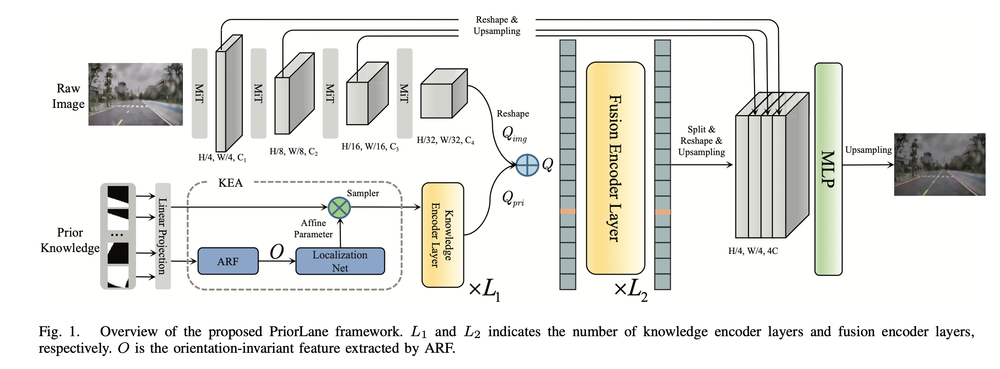

This repository is the official Pytorch implementation of [PriorLane](https://arxiv.org/abs/2209.06994).
<div  align="center">   
 
</div>

PriorLane is a novel and general framework, which is proposed to fuse the image feature with the prior knowledge to enchance the performance of lane segmentation. The prior knowledge used in our experiments is extracted from the open source [Open Street Map](https://www.openstreetmap.org) data, which is low-cost.

If you don't have prior knowledge in your dataset, we employed an intuitive extension of segformer by adding a bench for lane marking existence prediction, which is called MiT-Lane in our experiments. The ```whole``` model could be pre-trained on ```ImageNet``` dataset, and fine-tuned for lane segmentation, since the transformer-only architecture used in lane detection and general segmentation are unified in an elegant way.

## Installation
We use [SegFormer](https://github.com/open-mmlab/mmsegmentation/tree/master/configs/segformer) as the codebase, which is on ```MMSegmentation```.  For lane detection without prior knowledge, here is an example (```CUDA 11.4```):
```
conda create --name priorlane python=3.7
conda activate priorlane
conda install pytorch=1.9.1 torchvision cudatoolkit
conda install pillow=6.1
pip install IPython
pip install matplotlib
pip install mmsegmentation
pip install timm==0.3.2
pip install mmcv-full==1.2.7
pip install opencv-python==4.5.1.48
cd Priorlane && pip install -e . --user
```
For lane detection with prior knowledge, Active Rotation Filter implemented by [ORN](https://github.com/ZhouYanzhao/ORN/tree/pytorch-v2) needs to be installed:
```
cd mmseg/models/orn
pip install .
```

## Data Prepare
### TuSimple & CULane
For TuSimple, prepare the data like this:
```
├── tusimple
│   ├── clips
│   │   ├── dir1
│   │   │   ├── fold1
│   │   │   │   ├── ***.jpg
│   ├── seg_label
│   │   ├── dir1
│   │   │   ├── fold1
│   │   │   │   ├── ***.png
│   ├── list
│   │   ├── train_gt.txt
│   │   ├── val_gt.txt
│   │   ├── test_gt.txt
```
For CULane, prepare the data like this:
```
├── culane
│   ├── dir1
│   │   ├── **.mp4
│   │   │   ├── ***.jpg
│   │   │   ├── ***.lines.txt
│   ├── laneseg_label_w16
│   │   ├── dir1
│   │   │   ├── **.mp4
│   │   │   │   ├── ***.png
│   │   │   │   ├── ***.lines.txt
│   ├── list
│   │   ├── train_gt.txt
│   │   ├── val_gt.txt
│   │   ├── test_gt.txt
```
<!-- The existence of lane markings are labelled on the two famous benchmarks, which will be used in our model. -->
### Custom data with prior knowledge
Prepare your lane detection datas with prior knowledge as follows:
```
├── Custom data with prior knowledge
│   ├── imgs
│   │   ├── **.jpg
│   ├── seg
│   │   ├── **.png
│   ├── prior (local prior knowledge rendered into a image)
│   │   ├── **.png
│   ├── list
│   │   ├── train.txt(an img id per row)
│   │   ├── val.txt
│   │   ├── test.txt
```

### Prior knowledge rendering
We use an image with multi-channels to represent the local prior knowledge, and the prior knowledge used in our experiments is generated from the OSM data.

Step 1: Export global prior knowledge from OSM web.

 


Step 2: Use [osm2geojson](https://github.com/aspectumapp/osm2geojson) to convert the data into geojson format.

Step 3: Use ```python-opencv``` to render geometries with different propertes in the geojson file, and the global prior knowledge is represented as a big image.

Step 4: Crop local prior knowledge from the global image, here is an example:
```
global_img = cv2.imread(path_to_global_image)
def get_local_prior(range=100):
    utmx, utmy = get_current_utm_pose()
    # 5 pixels == 1 meter
    # (startx, starty): utm value of the top-left point of global image.
    px, py = math.ceil((utmx-startx)*5), math.ceil(abs(utmy-starty)*5)
    point = [px, py]
    x1, x2, y1, y2 = point[0]-range, point[0]+range, point[1]-range, point[1]+range
    crop_x1 = max(0, x1)
    crop_y1 = max(0, y1)
    crop_x2 = min(global_img.shape[1], x2)
    crop_y2 = min(global_img.shape[0], y2)
    mtx = global_img[crop_y1:crop_y2, crop_x1:crop_x2]
    left_x = -x1
    top_y = -y1
    right_x = x2 - global_img.shape[1]
    down_y = y2 - global_img.shape[0]
    if (top_y > 0 or down_y > 0 or left_x > 0 or right_x > 0): # Out of the boundary.
        left_x = left_x if left_x> 0 else 0
        right_x = right_x if right_x> 0 else 0
        top_y = top_y if top_y> 0 else 0
        down_y = down_y if down_y> 0 else 0
        dest_mtx = cv2.copyMakeBorder(mtx, top_y, down_y, left_x, right_x, cv2.BORDER_CONSTANT, value=(0,0,0))
    else:
        dest_mtx = mtx
    # Rotate the local img
    rows, cols, chs = dest_mtx.shape
    img_circle = np.zeros((rows,cols,1),np.uint8)
    img_circle = cv2.circle(img_circle,(int(cols/2),int(rows/2)),int(min(rows, cols)/2),(1),-1)
    local_map = dest_mtx[:,:,0]*img_circle[:,:,0]
    local_map = np.array([local_map]*3)
    local_map = np.ascontiguousarray(local_map.transpose((1,2,0)))
    (h, w) = local_map.shape[:2]
    (cX, cY) = (w // 2, h // 2)
    M = cv2.getRotationMatrix2D((cX, cY), random.randint(0,360), 1.0)
    rotated = cv2.warpAffine(local_map, M, (w, h))
    rotated[rotated[:,:,0]>0] = (1,1,1)
    return rotated
```
## Training

Download [mit_b5 weights](https://drive.google.com/drive/folders/1b7bwrInTW4VLEm27YawHOAMSMikga2Ia?usp=sharing) pretrained on ImageNet-1K, and put it in the folder ```pretrained/```.

Example: train ```PriorLane``` on your custom dataset with prior knowledge:
```
bash tools/dist_train_lane_detection_with_prior.sh
```
Please refer to ```local_configs/priorlane``` for corresponding configurations, you can also modify the configurations according to the custom dataset, and the trained results will be saved in ```work_dirs```.

Example: train ```MiT-Lane``` on ```TuSimple & CULane```

```
bash tools/dist_train_tusimple.sh
or
bash tools/dist_train_culane.sh
```
## Evaluation

<!-- Download [trained weights](). -->

Evaluate on ```TuSimple``` using official metric:
```
python tools/test_tusimple_metric.py ./local_configs/priorlane/tusimple.py ./work_dirs/tusimple/mit_tusimple.pth
```
Produce the ```pred.json``` file under tusimple_data_root, and use ```tools/lane_evaluation/tusimple/lane.py``` for metric calculation.

Evaluate on ```CULane``` using official metric:
```
python tools/test_culane_metric.py ./local_configs/priorlane/culane.py ./work_dirs/culane/mit_culane.pth
```
Produce ```coord_output``` dir under culane_data_root, run ```bash tools/lane_evaluation/CULane/Run.sh``` to calculate the F1-measure. For evaluation tool install, please refer to 
[SCNN](https://github.com/XingangPan/SCNN).


## License
```
The code is for research purpose only, for detail, please check the LICENSE file in the repositores referenced by our code.
```
## Refenerce

- [SegFormer](https://github.com/NVlabs/SegFormer) for MiT and decode head implementation.
- [FP-DETR](https://github.com/encounter1997/FP-DET) for fusion transformer design.
- [ORN](https://github.com/ZhouYanzhao/ORN/tree/pytorch-v2) for ARF and ORPooling implementation.
- [SCNN](https://github.com/XingangPan/SCNN) for TuSimple and CULane evaluation.
- [osm2geojson](https://github.com/aspectumapp/osm2geojson) for conversion from osm data to geojson format.


